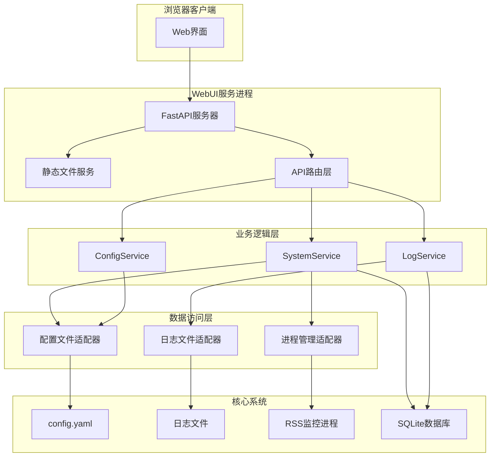

# WebUI功能技术设计文档

## 概述

WebUI功能是一个基于Web的用户界面系统，采用非侵入式架构设计，为Alist-MikananiRss提供可视化管理能力。该系统基于FastAPI(use context7 获取 FastAPI 文档进行编码)构建RESTful API，使用现代前端技术实现响应式界面，通过适配器模式与现有核心系统集成，确保不影响CLI和Telegram机器人的正常功能。

WebUI将作为独立的服务进程运行，通过共享配置和数据库连接与核心系统交互，实现日志查看、系统控制和配置管理三大核心功能。

## 指导文档对齐

### 技术标准 (tech.md)

WebUI设计严格遵循项目的现有技术架构和原则：

**异步架构一致性**
- 采用FastAPI作为Web框架，支持async/await异步编程
- 使用aiohttp(use context7 to get aiohttp 文档)作为HTTP客户端，与现有技术栈保持一致
- 所有API端点均为异步函数，确保与核心系统的异步协调

**模块化设计**
- WebUI相关代码组织在独立的webui模块中
- 遵循单一职责原则，每个文件专注于特定功能
- 通过接口抽象实现与核心系统的松耦合

**错误处理策略**
- 采用分层错误处理机制，继承现有异常体系
- 实现优雅降级，WebUI故障不影响核心功能
- 提供详细的错误日志和用户友好的错误信息

### 项目结构 (structure.md)

WebUI实现将严格遵循现有的项目组织结构：

**目录结构扩展**
```
src/alist_mikananirss/
├── webui/                          # 新增WebUI模块
│   ├── __init__.py                 # 模块初始化
│   ├── server.py                   # FastAPI服务器
│   ├── api/                        # API路由层
│   │   ├── __init__.py
│   │   ├── system.py               # 系统控制API
│   │   ├── logs.py                 # 日志查看API
│   │   └── config.py               # 配置管理API
│   ├── services/                   # 业务逻辑层
│   │   ├── __init__.py
│   │   ├── system_service.py       # 系统状态服务
│   │   ├── log_service.py          # 日志处理服务
│   │   └── config_service.py       # 配置管理服务
│   ├── static/                     # 静态文件
│   │   ├── css/
│   │   ├── js/
│   │   └── images/
│   └── templates/                  # HTML模板
│       ├── base.html
│       ├── dashboard.html
│       ├── logs.html
│       └── config.html
```

**命名规范**
- 类名采用大驼峰命名 (LogService, ConfigService)
- 函数名采用小写下划线 (get_system_status, update_config)
- 文件名采用小写下划线 (system_service.py)

## 代码重用分析

### 现有组件利用

**配置管理系统**
- **AppConfig/ConfigManager**: 直接复用现有配置模型和管理器
- **基础配置模块**: 利用CommonConfig、AlistConfig等已定义的配置模型
- **YAML序列化**: 复用现有的配置序列化和反序列化逻辑

**日志系统**
- **loguru集成**: 直接使用现有的loguru日志配置
- **日志文件结构**: 利用现有的日志轮转和存储机制
- **日志级别管理**: 复用现有的日志级别配置

**核心系统接口**
- **RssMonitor**: 通过现有接口获取系统运行状态
- **DownloadManager**: 利用现有的任务状态查询功能
- **数据库连接**: 复用SubscribeDatabase的连接池和查询方法

### 集成点

**配置文件集成**
- WebUI通过ConfigManager读写config.yaml文件
- 实时监控配置文件变化并同步到Web界面
- 利用Pydantic模型进行配置验证

**数据库集成**
- 复用SQLite数据库连接和查询接口
- 利用现有的数据模型查询订阅历史和任务状态
- 通过数据库获取系统运行统计信息

**进程管理集成**
- 通过进程ID(PID)管理主程序启停
- 利用信号机制实现优雅关闭
- 通过共享状态获取系统运行状态

## 架构设计

### 整体架构



### 模块化设计原则

**单一文件职责**
- `server.py`: 专注于Web服务器启动和配置
- `api/system.py`: 专注于系统控制相关的API端点
- `services/log_service.py`: 专注于日志处理逻辑
- `templates/config.html`: 专注于配置管理界面

**组件隔离**
- API层、服务层、数据访问层完全分离
- 每个服务组件可独立测试和维护
- 前端组件通过REST API与后端交互

**服务层分离**
- API层处理HTTP请求和响应
- 服务层处理业务逻辑和数据转换
- 数据访问层处理与外部系统的交互

## 组件和接口

### 组件1: FastAPI服务器 (server.py)

**用途**: WebUI的主要入口点，负责启动HTTP服务器和路由配置

**接口**:
- `create_app() -> FastAPI`: 创建和配置FastAPI应用
- `start_server(host: str, port: int, config_path: str)`: 启动Web服务器
- `shutdown_handler()`: 优雅关闭服务器

**依赖**: FastAPI, uvicorn, jinja2

**复用**: 现有的配置管理系统和日志系统

### 组件2: 系统控制服务 (services/system_service.py)

**用途**: 管理Alist-MikananiRss主程序的启动、停止和状态查询

**接口**:
- `get_system_status() -> SystemStatus`: 获取当前系统运行状态
- `start_system(config_path: str) -> OperationResult`: 启动主程序
- `stop_system() -> OperationResult`: 停止主程序
- `restart_system() -> OperationResult`: 重启主程序

**依赖**: subprocess, signal, psutil

**复用**: 现有的main.py启动逻辑和配置管理

### 组件3: 日志服务 (services/log_service.py)

**用途**: 处理日志文件的读取、过滤和实时流式传输

**接口**:
- `get_log_files() -> List[LogFileInfo]`: 获取可用日志文件列表
- `get_log_content(date: str, filters: LogFilters) -> LogContent`: 读取特定日期的日志
- `stream_logs(filters: LogFilters) -> AsyncIterator[str]`: 实时日志流
- `search_logs(query: str, date_range: DateRange) -> List[LogEntry]`: 日志搜索

**依赖**: aiofiles, pathlib, re

**复用**: 现有的loguru配置和日志文件结构

### 组件4: 配置服务 (services/config_service.py)

**用途**: 处理配置的读取、验证、更新和持久化

**接口**:
- `get_config_schema() -> ConfigSchema`: 获取配置项的JSON Schema
- `get_current_config() -> AppConfig`: 获取当前配置
- `update_config(updates: ConfigUpdates) -> ValidationResult`: 更新配置
- `validate_config(config_data: dict) -> ValidationResult`: 验证配置有效性
- `reset_to_defaults(section: str) -> AppConfig`: 重置配置为默认值

**依赖**: pydantic, yaml, jsonschema

**复用**: 现有的AppConfig模型和ConfigManager类

### 组件5: API路由层 (api/)

**用途**: 处理HTTP请求，调用相应的服务，返回JSON响应

**system.py接口**:
- `GET /api/system/status`: 获取系统状态
- `POST /api/system/start`: 启动系统
- `POST /api/system/stop`: 停止系统
- `POST /api/system/restart`: 重启系统

**logs.py接口**:
- `GET /api/logs/files`: 获取日志文件列表
- `GET /api/logs/content`: 获取日志内容
- `GET /api/logs/stream`: 实时日志流 (Server-Sent Events)
- `POST /api/logs/search`: 搜索日志

**config.py接口**:
- `GET /api/config/schema`: 获取配置模式
- `GET /api/config`: 获取当前配置
- `PUT /api/config`: 更新配置
- `POST /api/config/validate`: 验证配置

## 数据模型

### SystemStatus模型
```python
@dataclass
class SystemStatus:
    is_running: bool              # 系统是否正在运行
    pid: Optional[int]            # 进程ID
    uptime: Optional[int]         # 运行时长(秒)
    last_start_time: Optional[datetime]  # 最后启动时间
    version: str                  # 系统版本
    config_file: str              # 配置文件路径
    log_file: str                 # 当前日志文件路径
```

### LogFileInfo模型
```python
@dataclass
class LogFileInfo:
    date: str                     # 日志日期 (YYYY-MM-DD)
    file_path: str               # 文件路径
    file_size: int               # 文件大小(字节)
    last_modified: datetime      # 最后修改时间
```

### LogEntry模型
```python
@dataclass
class LogEntry:
    timestamp: datetime           # 日志时间戳
    level: str                   # 日志级别 (INFO, ERROR, etc.)
    logger_name: str             # 记录器名称
    message: str                 # 日志消息
    file_path: Optional[str]     # 源文件路径
    line_number: Optional[int]   # 行号
```

### ConfigUpdates模型
```python
@dataclass
class ConfigUpdates:
    section: str                 # 配置节名称 (common, alist, etc.)
    updates: Dict[str, Any]      # 更新的配置项
    backup_current: bool = True  # 是否备份当前配置
```

### ValidationResult模型
```python
@dataclass
class ValidationResult:
    is_valid: bool               # 验证是否通过
    errors: List[str]            # 错误信息列表
    warnings: List[str]          # 警告信息列表
    updated_config: Optional[AppConfig]  # 更新后的配置对象
```

## 错误处理

### 错误场景1: 系统启动失败
**描述**: 用户尝试启动系统但启动失败
**处理方式**:
- 检查配置文件有效性
- 验证必要的外部依赖(如Alist服务)
- 返回详细的错误信息和解决建议
**用户影响**: 显示启动失败原因，提供具体的修复步骤

### 错误场景2: 配置验证失败
**描述**: 用户提交的配置不通过验证
**处理方式**:
- 使用Pydantic进行详细的配置验证
- 返回具体的字段级别错误信息
- 高亮显示配置文件中的问题行号
**用户影响**: 显示具体的配置错误，帮助用户快速定位问题

### 错误场景3: 日志文件读取失败
**描述**: 日志文件不存在或权限不足
**处理方式**:
- 检查日志文件是否存在
- 验证文件读取权限
- 提供文件系统权限修复建议
**用户影响**: 显示友好的错误信息，建议检查文件权限

### 错误场景4: WebUI服务异常
**描述**: WebUI服务本身出现异常
**处理方式**:
- 记录详细的错误日志
- 提供系统状态页面显示服务异常
- 不影响核心RSS监控功能
**用户影响**: 显示服务维护页面，提供手动修复指导

## 测试策略

### 单元测试
**测试方法**: 使用pytest进行单元测试
**关键组件**:
- `test_system_service.py`: 测试系统启停逻辑
- `test_log_service.py`: 测试日志读取和过滤功能
- `test_config_service.py`: 测试配置验证和更新逻辑
- `test_api_endpoints.py`: 测试API端点的请求响应

**测试重点**:
- 配置验证逻辑的边界条件
- 日志过滤和搜索功能的准确性
- 错误处理机制的完整性
- 异步操作的正确性

### 集成测试
**测试方法**: 使用TestClient进行FastAPI集成测试
**关键流程**:
- 完整的配置更新流程
- 系统状态查询的准确性
- 日志实时流的稳定性
- 前端与API的交互

**测试工具**:
- httpx用于异步HTTP测试
- aioresponses用于模拟外部服务
- pytest-asyncio支持异步测试

### 端到端测试
**测试方法**: 使用Selenium或Playwright进行浏览器自动化测试
**用户场景**:
- 用户通过Web界面查看日志并搜索特定内容
- 用户修改配置并验证系统行为
- 用户通过Web界面控制系统启停
- 响应式界面在不同设备上的表现

**测试环境**:
- 使用Docker容器模拟完整的运行环境
- 模拟真实的文件系统和数据库状态
- 测试不同浏览器的兼容性